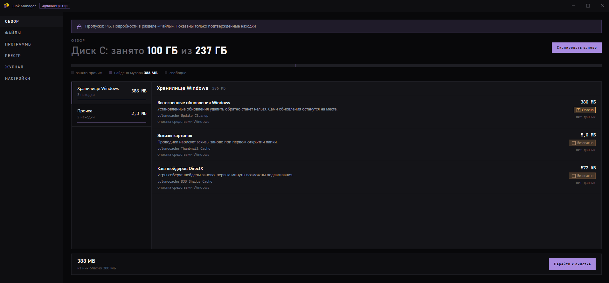
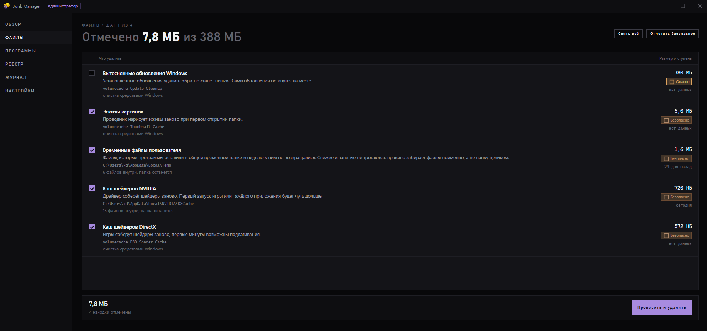
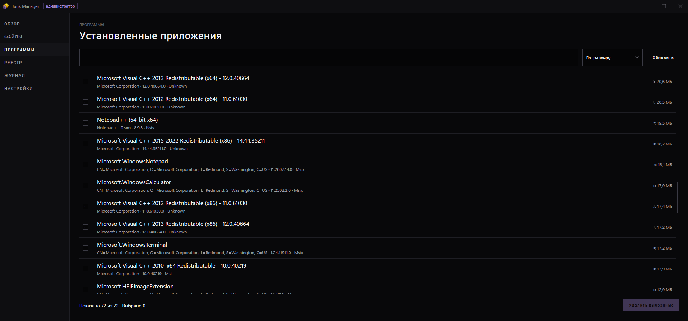
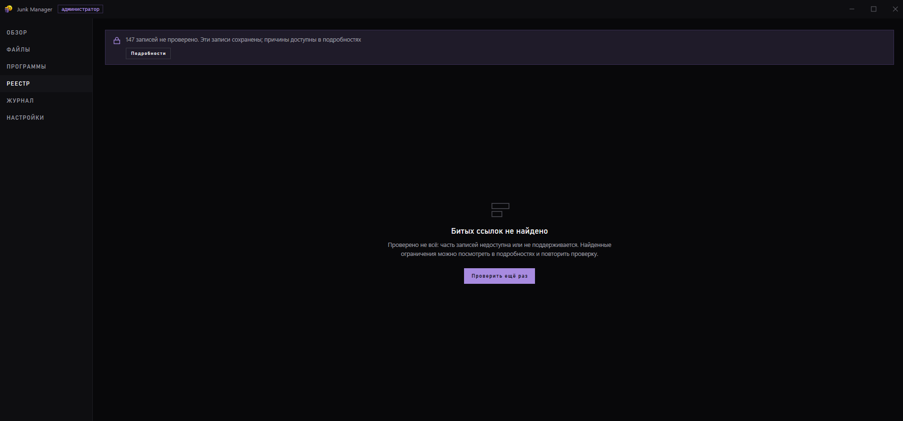
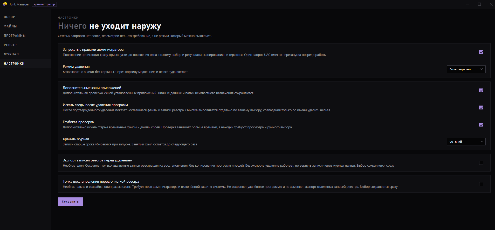

  

<h1 align="center">Junk Manager</h1>

Чистит кэш и временные файлы, удаляет программы и находит устаревшие записи реестра в Windows.

  <a href="https://github.com/zxczxczxczxczxczxc1111/junk-manager/releases">Скачать</a> ·
  <a href="https://github.com/zxczxczxczxczxczxc1111/junk-manager/issues/new/choose">Сообщить об ошибке</a> ·
  <a href="LICENSE">MIT</a>

  
   Результат сканирования

<table>
  <tr>
    <td width="50%"></td>
    <td width="50%"></td>
  </tr>
  <tr><td align="center">Файлы</td><td align="center">Программы</td></tr>
  <tr>
    <td width="50%"></td>
    <td width="50%"></td>
  </tr>
  <tr><td align="center">Реестр</td><td align="center">Настройки</td></tr>
</table>

## Что умеет

- Находит кэш браузеров, приложений и игр, временные файлы Windows и дампы сбоев.
- Показывает найденные файлы, их размер и последствия удаления.
- Удаляет программы через их штатные деинсталляторы, затем предлагает проверить оставшиеся файлы и записи реестра.
- Считает размер приложений, если установщик его не указал.
- Находит записи реестра, которые ссылаются на отсутствующие файлы.
- Ведёт журнал очистки.

## Как пользоваться

Скачай `JunkManager.exe` из раздела [«Релизы»](https://github.com/zxczxczxczxczxczxc1111/junk-manager/releases) и запусти. Устанавливать приложение или отдельно скачивать .NET не нужно.

Нажми «Сканировать диск», посмотри находки и выбери, что удалить. Для удаления программ и проверки реестра есть отдельные вкладки.

По умолчанию файлы удаляются без корзины. В настройках можно выбрать удаление в корзину, включить экспорт записей реестра и создание точки восстановления.

## Что стоит знать

Приложение работает без интернета и не отправляет телеметрию. Для части функций нужны права администратора.

Глубокая проверка включается в настройках. Её находки нужно выбирать вручную.

Проверено на Windows 11 x64. Интерфейс на русском языке. Сборка пока без цифровой подписи, поэтому Windows может показать предупреждение при запуске.

[Сборка из исходников и тестирование](docs/DEVELOPMENT.md) · [Сообщить об ошибке](https://github.com/zxczxczxczxczxczxc1111/junk-manager/issues/new/choose)

Лицензия [MIT](LICENSE). Лицензии зависимостей находятся в [THIRD_PARTY_NOTICES.txt](THIRD_PARTY_NOTICES.txt).
